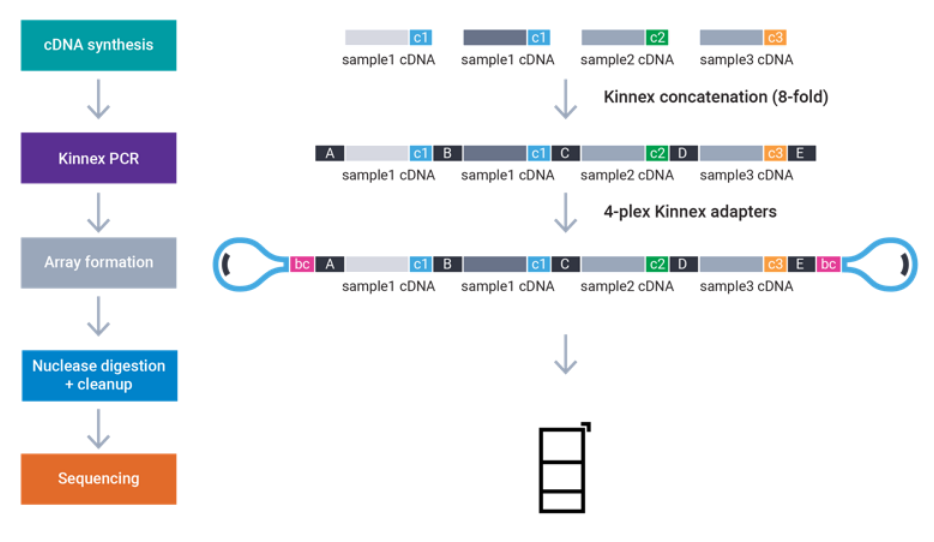
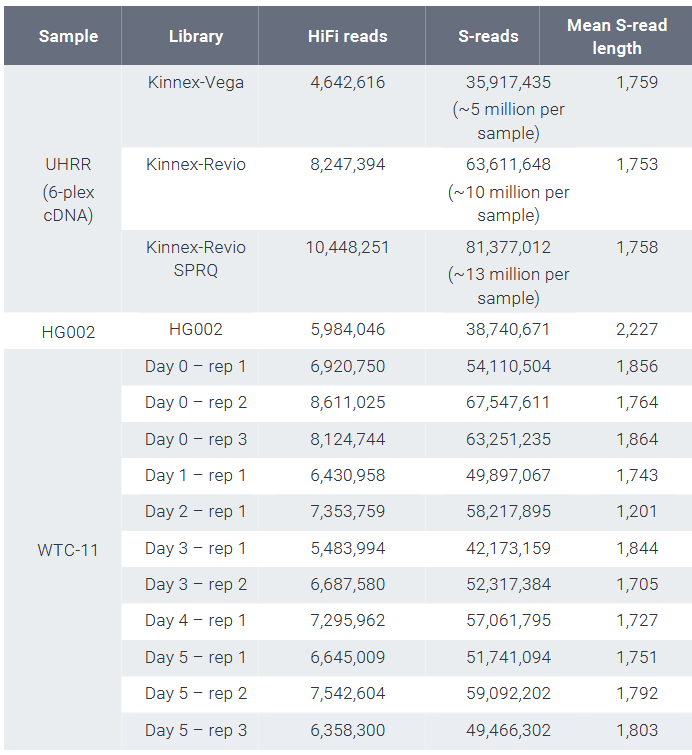

# Introduction
The RAGE24 RNA were barcoded with IsoSeq-primers in two batches at cDNA level (bc01-bc12). The Kinnex library was generated with Kinnex full-length RNA kit. In the first batch, we received the segmented data. In the second batch, we received the unsegmented data. For both batches, all samples on one flow cell were annealed with the same Kinnex terminal adapter (bcM0001-bcM0004). 

## File formats
- The bam/fastq files have prefixes in format `RAGE24_<rat_id>_<tissue>_longread_<SMRT_cellbarcode>`. For example,
`RAGE24_A01_KYC-LN_longread_EA216488`. 
    - The reason for having SMRT cell barcode is to distinguish samples that were sequenced multiple times on different SMRT cells/runs. For rat Q17, we generated two long-read libraries and sequenced twice from KYC-LN. For rat H08, the same long read library was sequenced on two different SMRT cells.
- The final files/sample names should have prefixes in format `RAGE24_<rat_id>_<tissue>_longread`. At this stage, different runs are aggregated together.

## Resources
- Example Kinnex full-length RNA data sets
    - [Kinnex full-length RNA data sets](https://downloads.pacbcloud.com/public/dataset/Kinnex-full-length-RNA/)
        - [BrainUHRR project folder](https://downloads.pacbcloud.com/public/dataset/Kinnex-full-length-RNA/DATA-Revio-IDT-BrainUHRR/)
        - [Example Revio run summary pdf](https://downloads.pacbcloud.com/public/dataset/Kinnex-full-length-RNA/DATA-Revio-IDT-BrainUHRR/SL-CCS-KinnexBulkIDTbrain.pdf)
    - [Application note of Kinnex full-length RNA](https://www.pacb.com/wp-content/uploads/Application-note-Kinnex-full-length-RNA-kit-for-isoform-sequencing.pdf) This application note contains a summary for the datasets above. 
- [SMRT Link user guide](https://www.pacb.com/wp-content/uploads/SMRT-Link-v25.2-user-guide.pdf)
- [SMRT Link Kinnex full-length RNA troubleshooting guide](https://www.pacb.com/wp-content/uploads/SMRT-Link-Kinnex-full-length-RNA-troubleshooting-guide.pdf)
    - This one contains filtering criterion and example isoform classifications. 
- [Kinnex workflow](https://pacbio.cn/wp-content/uploads/Technical-overview-Kinnex-kits-for-single-cell-RNA-full-length-RNA-and-16S-rRNA-sequencing.pdf)
    - To understand the Kinnex workflow, it is useful to read the original [MAS-Seq](https://www.nature.com/articles/s41587-023-01815-7) paper (later named Kinnex) 
    - [Single-cell version of Kinnex workflow](https://pacbio.cn/wp-content/uploads/Technical-overview-MAS-Seq-library-preparation-using-MAS-Seq-for-10x-Single-Cell-3-kit.pdf)
- [Kinnex mutiplexing strcuture and primers](https://www.pacb.com/multiplexing/)
- [PacBio BAM format specification](https://pacbiofileformats.readthedocs.io/en/11.0/BAM.html)
    - This one includes explanation of BAM header tags

## Kinnex Full-length RNA Mechanism
Below is a good illustration of what Kinnex library structure is


There are 3 kinds of adapter:
- The <span style="color:blue">blue</span> barcode (BC) is the barcode of Kinnex terminal adapter (bcM0001-bcM0004).
- The <span style="color:pink">pink</span> barcode is the IsoSeq primer barcode (bc01-bc12).
- The different color "A", "B", "C", ..."Q" are kinnex (MAS-Seq) adapters. 

The skera segmentation is based on A, B, C, ... Q. 

The 8 adapter primer sequences are (Q is the last one):
```
>A
AGCTTACTTGTGAAGAT
>B
ACTTGTAAGCTGTCTAT
>C
ACTCTGTCAGGTCCGAT
>D
ACCTCCTCCTCCAGAAT
>E
AACCGGACACACTTAGT
>F
AGAGTCCAATTCGCAGT
>G
AATCAAGGCTTAACGGT
>H
ATGTTGAATCCTAGCGT
>Q
AGTAGCTGTGTGCA
```
Another illustration is from the application note:


## General processing steps
1. Generate circular consensus reads (CCS) from subreads: as we know, the PacBio's read unit (ZMW) reads a circular multiple times. We have to generate a consensus read from these subreads. **This step is done on the machine.**
2. Demultiplex Kinnex terminal adapter barcodes (bcM0001-bcM0004): this is **done on the machine** with lima mostly. 
3. Use Skera to segment the reads with MAS-Seq adapters. For Kinnex full-length RNA, the adapter version is v3 (up to 07/2025). **This step is done on the machine usually.**
4. Use lima to demultiplex IsoSeq primer barcodes into individual full-length read (bam or fastq) for each sample.
5. Downstream analysis.

### Batch 1-sequenced on 2025/03
This batch contains 4 samples, and the terminal adapter is bcM0001. For this batch, demultiplexing was done using lima on the machine. For more information on what was done to get to the fastq, refer to the Demultiplex Barcodes section (pages 117-123) in the [SMRT Link user guide](https://www.pacb.com/wp-content/uploads/SMRT-Link-v25.2-user-guide.pdf). What we have here should be already demultiplexed reads with lima (so no further demultiplexing is needed).

For this batch, we have to reidentify the samples by modifying the BioSample tag in the bam file header (for IsoSeq pipeline). For running IsoQuant, we convert the modified bam files to fastq and start from there.

### Batch 2-sequenced on 2025/06
This batch contains 21 samples sequenced on 5 SMRT cells. We start from the unsegmented reads (after first lima terminal barcode demultiplexing).

## Preparation notes from Admera
The Full-Length RNA sequencing was performed at Admera Health (Admera health LLC., New Jersey, USA).

The isolated RNA sample quality was assessed by High Sensitivity RNA Tapestation (Agilent Technologies Inc., California, USA) and quantified by AccuBlue® Broad Range RNA Quantitation assay (Biotium, California, USA).

The Kinnex™ libraries were created using the Kinnex full-length RNA kit (Pacbio, California, United States) following the manufacturer`s protocol.  Briefly, 450ng of RNA was used for cDNA synthesis using the Iso-Seq® Express 2.0 Kit (Pacbio, California, United States). 27.5ng of barcoded cDNA from each sample was pooled for Kinnex PCR. Eight parallel Kinnex PCR reactions with Kinnex primers were performed to generate DNA fragments containing orientation-specific Kinnex segmentation sequences followed by 4-plex Kinnex array formation. The final library was quantified using Qubit and qualified using the Agilent genomic DNA ScreenTape (Agilent Technologies Inc., California, USA) and sequenced on Pacbio Revio SMRTCell.  

# Workflow
We broke up the whole workflow into several steps, instead of a full workflow, because the pipeline was not fully developed when we received the data. We QC'ed the data every step of the way.
## Prerequisites
### 1. Prepare environment
#### Singularity (recommended)
Within local, we can build a docker container, and then on PMACS, we need to download the singularity image. To run the scripts, we need to create a script on PMACS and submit the job with a singularity wrapper.
```sh
mkdir -p ~/images
singularity pull -F --dir ~/images docker://garywang7/isoseq:1.0.4 
# For running singularity in shell, we need to initialize it
# bsub -n 10 -M 100000 -Is bash
# singularity shell ~/images/isoseq_1.0.4.sif
# eval "$(micromamba shell hook --shell bash)"
```

### 2. Define directories and download reference primers
```sh
# Define the directories
project_dir=/home/garyw7/RAGE_longread
output_dir=$project_dir/isoseq
raw_dir=$project_dir/raw

script_dir=/project/parkercwlab/gary/scripts/RAGE/bulk_long_read/isoseq

ref_dir=$project_dir/reference
mkdir -p $ref_dir

cd $ref_dir
# Download isoseq primer
wget https://downloads.pacbcloud.com/public/dataset/Kinnex-full-length-RNA/REF-primers/IsoSeq_v2_primers_12.fasta
# the MAS-Seq adapter primer sequences are provided by PacBio technical support
```
### 3. Prepare reference genome and gtf
The starting gtf and genome are the ones we prepared for cell ranger. Refer to **make_rat_ref.sh**. To make those compatible with pigeon, refer to ["How to create a pigeon‐compatible annotation GTF"](https://isoseq.how/classification/pigeon-annotation.html).

```sh
bsub -n 10 -M 80000 -Is bash
module load R/4.3
R
```

```R
library(here)
library(fs)
library(tidyverse)
BiocManager::install("plyranges") # May be prompted to use a personal R library
library(plyranges)
library(future.apply)

plan(multicore, workers = 10) 
options(future.globals.maxSize = 80000 * 1024^2) #For 80 Gb RAM. 

# Directories
project_dir <- "/home/garyw7/RAGE_longread"
ref_dir <- here(project_dir, "reference")
dir_create(here(ref_dir, "pigeon"))

# We modify from the gtf file we used for RAGE24 single-cell data
gtf_raw <- rtracklayer::import(here(ref_dir, "cellranger_filtered_GCF_036323735.1_GRCr8_mt.gtf"))

# We first adjust the gtf format by appending one field and transcript ID format:
gtf <- gtf_raw %>%
  plyranges::mutate(gene_name = gene) %>%
  plyranges::mutate(transcript_id = ifelse(transcript_id == "", yes = NA, no = transcript_id))

#### 1. Edit the genes without a gene entry ####
# All the genes need to have a gene entry.
genes <- unique(gtf$gene_id)

genes_with_gene_type <- plyranges::filter(gtf, type == "gene") %>% as.data.frame() %>% pull(gene_id)

genes_without_gene_type <- genes[!genes %in% genes_with_gene_type]

# Loop through all the genes, if there is no gene name entry, manually create one.
mod_gene_ls<-future_lapply(genes_without_gene_type, function(g){
  g.gr <- plyranges::filter(gtf, gene_id == g)
  biotype <- ifelse(length(unique(g.gr$transcript_biotype))>1,
                    yes = paste0(unique(g.gr$transcript_biotype),collapse = "_"),
                    no = unique(g.gr$transcript_biotype))
  g.entry.gr <- plyranges::filter(g.gr, type == "transcript")
  g.entry.gr <- g.entry.gr[1]%>%
  mutate(
    start = min(start(g.gr)),
    end = max(end(g.gr)),
        type = "gene",
         transcript_id = NA,
         gbkey = "Gene",
         gene_biotype = biotype,
         transcript_biotype = NA)
  final.gr <- append(g.entry.gr, g.gr)
})

# Append the dataframe
mod_gene_GR <- do.call(c, mod_gene_ls)

# Remove the previous entries
gtf2 <- plyranges::filter(gtf, !gene_id %in% genes_without_gene_type)
gtf2 <- c(gtf2, mod_gene_GR) %>%
  plyranges::arrange(seqnames, gene_id)

#### 2. Remove the space in gene_id and gene_name ####
gtf2$gene_id <- gsub(pattern = " ", replacement = "", gtf2$gene_id)
gtf2$gene_name <- gsub(pattern = " ", replacement = "", gtf2$gene_name)

# Export gtf file
rtracklayer::export(gtf2, here(ref_dir, "pigeon",
                              "pigeon_GRCr8_mt.gtf"), format = "gff2")
```
Then we run pigeon prepare to generate pigeon-compatible gtf. There cannot be a '.' in the file names. We will copy the reference genome to the pigeon folder. This step will generate a file ending in sorted.gtf
```sh
ref_dir=/home/garyw7/RAGE_longread/reference
# We copy the fasta file into a different folder, as there cannot be "." in the file name
cp $ref_dir/GCF_036323735.1_GRCr8_mt.fna $ref_dir/pigeon/GRCr8_mt_2.fa

# Run singularity image
singularity shell ~/images/isoseq_1.0.4.sif
eval "$(micromamba shell hook --shell bash)"
micromamba activate isoseq_all

ref_dir=/home/garyw7/RAGE_longread/reference
pigeon prepare $ref_dir/pigeon/pigeon_GRCr8_mt.gtf \
    $ref_dir/pigeon/GRCr8_mt.fa \
    --log-level INFO
```

## Iso-Seq Pipeline
### 1. Segment reads
This only applies to batch 2. We will use step1_segment_read.sh as a template and singularity_wrapper.sh to generate scripts for each SMRT cell. We need to copy the template step_1 script to the script directory first. The script will be generated in the same directory. After generating the scripts, we will submit the jobs with singularity wrapper.
```sh
bsub -n 5 -M 10000 -Is bash
module load R/4.3
R
```
We will configure
```R
# Load required libraries
library(tidyverse)
library(fs)
library(here)
library(readxl)

# Directories
project_dir <- "/home/garyw7/RAGE_longread"
script_dir <- "/project/parkercwlab/gary/scripts/RAGE/bulk_long_read"
data_dir <- here(project_dir,"data")
ccs_dir <- here(data_dir,"0-CCS")
sread_dir <- here(data_dir,"1-Sreads")

dir_create(sread_dir)

# Number of threads
num_threads <- 20

# Read metadata
meta <- read_excel(here(project_dir,"meta","meta_RAGE24_longread_7_23_2025.xlsx"))

# edit filenames and directories for batch 2
b2file_meta <- meta %>%
# filter out the first batch
    filter(sequence_date == "06_2025") %>%
    mutate(
    ccs_file = dir_ls(path = here(ccs_dir, SMRT_cell_barcode), glob = "*.bam", type = "file"),
    sread_file_prefix = here(sread_dir, paste0("segmented_",SMRT_cell_barcode)))

smrt_cell_info <- b2file_meta %>%
    distinct(SMRT_cell_barcode, ccs_file, sread_file_prefix)

# Read template scripts
step1_template <- readLines(here(script_dir, "isoseq_PMACS","step1_segment_read.sh"))
wrapper_template <- readLines(here(script_dir, "isoseq_PMACS","singularity_wrapper.sh"))

# Directory for depositing the scripts
step1_dir <- here(script_dir, "isoseq_PMACS", "step1_segment_read")
dir_create(step1_dir)

# For each SMRT cell, generate step1 segment read script and singularity wrapper script.
for(i in 1:nrow(smrt_cell_info)) {
    smrt_cell_info_i <- smrt_cell_info[i,]
    # For step_1 script
    s1_script_dir_i <- here(step1_dir, paste0("step1_segment_read_", smrt_cell_info_i$SMRT_cell_barcode,".sh"))
    step1_i <- step1_template %>% 
    gsub("<input_bam>", smrt_cell_info_i$ccs_file, ., fixed = TRUE) %>%
    gsub("<output_bam>", smrt_cell_info_i$sread_file_prefix, ., fixed = TRUE) %>%
    gsub("<num_threads>", as.character(num_threads), ., fixed = TRUE)
    writeLines(step1_i, s1_script_dir_i)

    # For singularity wrapper script
    wrapper_dir_i <- here(step1_dir, paste0("singularity_wrapper_step1_", smrt_cell_info_i$SMRT_cell_barcode,".sh"))
    wrapper_i <- wrapper_template %>%
        str_replace(
            "<script_dir>", s1_script_dir_i
        )
    writeLines(wrapper_i, wrapper_dir_i)
}

# For each SMRT cell, submit the a job
log_dir <- here("/project/parkercwlab/gary/logs/isoseq")
dir_create(here(log_dir,"step1_segment_read"))

for(i in 1:nrow(smrt_cell_info)) {
    smrt_cell_info_i <- smrt_cell_info[i,]
    wrapper_dir_i <- here(step1_dir, paste0("singularity_wrapper_step1_", smrt_cell_info_i$SMRT_cell_barcode,".sh"))

    bsub_args <- c(
    "-q",  "normal",
    "-e",  shQuote(here(log_dir, "step1_segment_read", paste0("step1_segment_read_", smrt_cell_info_i$SMRT_cell_barcode,".log.error"))),
    "-o",  shQuote(here(log_dir, "step1_segment_read", paste0("step1_segment_read_", smrt_cell_info_i$SMRT_cell_barcode,".log.output"))),
    "-J",  shQuote(smrt_cell_info_i$SMRT_cell_barcode),
    "-n",  num_threads,
    "-M",  "70000", #70GB
    "-R",  shQuote("rusage[mem=70000] span[hosts=1]"),
    "sh",  shQuote(wrapper_dir_i) # submit the wrapper script
    )
    cat("Running:\n bsub ", paste(bsub_args, collapse = " "), "\n\n")
    res <- system2("bsub", args = bsub_args, stdout = TRUE, stderr = TRUE)

    # print LSF's reply
    cat(res, sep = "\n")
}

# Update the metadata with file directory information
smrt_cell_info <- smrt_cell_info %>%
    mutate(
        sread_file = paste0(sread_file_prefix, ".bam"),
        ccs_filename = path_file(ccs_file),
        sread_filename = path_file(sread_file)
    )

meta_updated <- meta %>%
    left_join(smrt_cell_info, by = "SMRT_cell_barcode")

write_csv(meta_updated, here(project_dir, "meta","meta_RAGE24_longread_post_step1_file_info.csv"))
```
#### 1.1 check segmentation results (optional)
According to the [Kinnex full-length RNA troubleshooting guide](https://www.pacb.com/wp-content/uploads/SMRT-Link-Kinnex-full-length-RNA-troubleshooting-guide.pdf), we can check the segmentation summary file for each SMRT cell. The summary file is named `*.summary.csv` and contains information about the number of reads, segments, and other metrics. A normal range is provided below:
| Metric                             | Explanation                                  | Typical value                                            |
|------------------------------------|----------------------------------------------|----------------------------------------------------------|
| Reads                              | Number of HiFi reads                         | Depends on sequencing yield                              |
| S‑reads                            | Number of segmented reads                    | Depends on HiFi read yield and concatenation success     |
| Mean Length of S‑reads             | Mean read length of S‑reads                  | Depends on sample type, but typically ~1.5–2 kb          |
| Percent of Reads with Full Arrays  | Percent of HiFi reads with full MAS arrays   | 85–90 %                                                  |
| Mean Array Size                    | Concatenation factor                         | ~7.xx                                                    |


```sh
bsub -n 5 -M 10000 -Is bash
module load R/4.3
R
```
```R
library(tidyverse)
library(fs)
library(here)
library(readxl)

# Directories
project_dir <- "/home/garyw7/RAGE_longread"

# Read metadata
meta <- read_csv(here(project_dir, "meta", "meta_RAGE24_longread_post_step1_file_info.csv"))

smrt_cell_info <- meta %>%
    distinct(SMRT_cell_barcode, sread_file, sread_filename) %>%
    na.omit() %>%
    mutate(
        summary_file = here(path_dir(sread_file), 
                paste0(path_ext_remove(sread_filename), ".summary.csv"))
    )

# Read the summary files
summary_list <- lapply(1:nrow(smrt_cell_info), function(smrt_cell){
    summary_file <- smrt_cell_info$summary_file[smrt_cell]
    summary_df <- read_csv(summary_file, col_names= c("metric", "value"))
})

names(summary_list) <- smrt_cell_info$SMRT_cell_barcode

# Bind dataframes and pivot wider
summary_df <- bind_rows(
  lapply(names(summary_list), function(id) {
    summary_list[[id]] %>% 
      mutate(smrt_cell_id = id)
  })
) %>%
  select(smrt_cell_id, metric, value) %>%
  pivot_wider(
    id_cols   = smrt_cell_id,
    names_from = metric,
    values_from = value
  )

# Save the summary dataframe
dir_create(here(data_dir,"QC"))
write_csv(summary_df, here(data_dir,"QC","1_segment_summary.csv"))
```
Below is the result:
| smrt_cell_id | Input Reads | Segmented Reads (S‑Reads) | Mean Length of S‑Reads | Percentage of Reads with Full Array | Mean Array Size (Concatenation Factor) |
|--------------|------------:|--------------------------:|-----------------------:|------------------------------------:|---------------------------------------:|
| EA216488     |     8854553 |                 67353004  |                   2289 |                             92.0315 |                                  7.6066 |
| EA216499     |     9160578 |                 70315095  |                   2310 |                             93.5456 |                                 7.67584 |
| EA216472     |    10154256 |                 77720789  |                   2071 |                             93.3695 |                                 7.65401 |
| EA216481     |    10342271 |                 81067001  |                   2101 |                             96.1008 |                                 7.83841 |
| EA216477     |     8094299 |                 60811918  |                   2524 |                             90.5512 |                                 7.51293 |

We can compare this to the [brainUHRR segmentation result](https://downloads.pacbcloud.com/public/dataset/Kinnex-full-length-RNA/DATA-Revio-IDT-BrainUHRR/1-Sreads/) in the [Kinnex-full-length-RNA example dataset](https://downloads.pacbcloud.com/public/dataset/Kinnex-full-length-RNA/). Our data has similar quality, and much better than the SCRI samples in the Kinnex dataset. A summary of some of the Kinnex full-length RNA datasets can be found in [Application note of Kinnex full-length RNA](https://www.pacb.com/wp-content/uploads/Application-note-Kinnex-full-length-RNA-kit-for-isoform-sequencing.pdf) ():



### 2. Demultiplex IsoSeq samples with lima
To run lima, we need a CSV listing each biosample name and its barcode pair. Because each SMRT cell requires its own file for correct assignment, we need one CSV per cell. And this still does not allow us to assign the file names. Any name corrections for the first batch can be handled later, so in this step we’ll simply use a single, common IsoSeq primer file for all samples.

#### 2.1 For batch 1 (03/2025), cp the demultiplexed reads to the data directory
```sh
bsub -n 5 -M 10000 -Is bash
raw_dir=/home/garyw7/RAGE_longread/raw
fl_raw_dir=/home/garyw7/RAGE_longread/data/2_1-FL_raw/EA194916
mkdir -p $fl_raw_dir

# copy index and bam over to the data directory (already ran. Do not run again)
# cp $raw_dir/*.bam.pbi $fl_raw_dir
# cp $raw_dir/*.bam $fl_raw_dir
# cp $raw_dir/*.consensusreadset.xml $fl_raw_dir
```
#### 2.2 for batch 2 (06/2025), we will use the segmented reads
```sh
bsub -n 5 -M 10000 -Is bash
module load R/4.3
R
```
```R
library(tidyverse)
library(fs)
library(here)

# Directories
project_dir <- "/home/garyw7/RAGE_longread"
script_dir <- "/project/parkercwlab/gary/scripts/RAGE/bulk_long_read"
data_dir <- here(project_dir,"data")
sread_dir <- here(data_dir,"1-Sreads")
fl_raw_dir <- here(data_dir,"2_1-FL_raw")

# Number of threads
num_threads <- 20

# Read metadata
meta <- read_csv(here(project_dir, "meta","meta_RAGE24_longread_post_step1_file_info.csv"))

# Read template scripts
step2_template <- readLines(here(script_dir, "isoseq_PMACS","step2_lima_demux.sh"))
wrapper_template <- readLines(here(script_dir, "isoseq_PMACS","singularity_wrapper.sh"))

# Directory for depositing the scripts
step2_dir <- here(script_dir, "isoseq_PMACS", "step2_lima_demux")
dir_create(step2_dir)

# For each SMRT cell, generate step2 lima demux script and singularity wrapper script.
smrt_cell_info <- meta %>%
    filter(sequence_date != "03_2025") %>%
    na.omit() %>%
    distinct(SMRT_cell_barcode, sread_file) %>%
    mutate(
        # The raw file handle is the first part of the demultiplexed file. There will be IsoSeqbcxx_5p--IsoSeq_3p after it after lima. For example,
        # fl_EA216477.IsoSeqX_bc06_5p--IsoSeqX_3p.bam
        fl_raw_file_handle = here(fl_raw_dir, SMRT_cell_barcode,paste0("fl_", SMRT_cell_barcode,".bam"))
    )

for(i in 1:nrow(smrt_cell_info)) {
    smrt_cell_info_i <- smrt_cell_info[i,]
    # Create the output directory for this SMRT cell
    dir_create(here(fl_raw_dir, smrt_cell_info_i$SMRT_cell_barcode))
    # For step_2 script
    s2_script_dir_i <- here(step2_dir, paste0("step2_lima_demux_", smrt_cell_info_i$SMRT_cell_barcode,".sh"))
    step2_i <- step2_template %>% 
        gsub("<input_bam>", smrt_cell_info_i$sread_file, ., fixed = TRUE) %>%
        gsub("<output_bam>", smrt_cell_info_i$fl_raw_file_handle, ., fixed = TRUE) %>%
        gsub("<num_threads>", num_threads, ., fixed = TRUE)
    writeLines(step2_i, s2_script_dir_i)

    # For singularity wrapper script
    wrapper_dir_i <- here(step2_dir, paste0("singularity_wrapper_step2_", smrt_cell_info_i$SMRT_cell_barcode,".sh"))
    wrapper_i <- wrapper_template %>%
        str_replace(
            "<script_dir>", s2_script_dir_i
        )
    writeLines(wrapper_i, wrapper_dir_i)
}

# For each SMRT cell, submit the a job
log_dir <- here("/project/parkercwlab/gary/logs/isoseq")
dir_create(here(log_dir,"step2_lima_demux"))

for(i in 1:nrow(smrt_cell_info)) {
    smrt_cell_info_i <- smrt_cell_info[i,]
    wrapper_dir_i <- here(step2_dir, paste0("singularity_wrapper_step2_", smrt_cell_info_i$SMRT_cell_barcode,".sh"))

    bsub_args <- c(
    "-q",  "normal",
    "-e",  shQuote(here(log_dir, "step2_lima_demux", paste0("step2_lima_demux_", smrt_cell_info_i$SMRT_cell_barcode,".log.error"))),
    "-o",  shQuote(here(log_dir, "step2_lima_demux", paste0("step2_lima_demux_", smrt_cell_info_i$SMRT_cell_barcode,".log.output"))),
    "-J",  shQuote(smrt_cell_info_i$SMRT_cell_barcode),
    "-n",  num_threads,
    "-M",  "70000", #70GB
    "-R",  shQuote("rusage[mem=70000] span[hosts=1]"),
    "sh",  shQuote(wrapper_dir_i) # submit the wrapper script
    )
    cat("Running:\n bsub ", paste(bsub_args, collapse = " "), "\n\n")
    res <- system2("bsub", args = bsub_args, stdout = TRUE, stderr = TRUE)

    # print LSF's reply
    cat(res, sep = "\n")
}

# Update the metadata with file directory information
smrt_cell_info <- smrt_cell_info %>%
    mutate(
        fl_raw_file_prefix = here(fl_raw_dir, SMRT_cell_barcode, paste0("fl_", SMRT_cell_barcode))
        )

meta <- meta %>%
    left_join(smrt_cell_info) %>%
    mutate(
        fl_raw_file = case_when(
            sequence_date == "03_2025" ~ here(fl_raw_dir, SMRT_cell_barcode, paste0(admera_id,".hifi_reads.bam")),
            sequence_date == "06_2025" ~ paste0(fl_raw_file_prefix, 
            ".IsoSeqX_",IsoSeq_cDNA_barcode, "_5p--IsoSeqX_3p.bam"
            )    
        )
        
    )
file_exists(meta$fl_raw_file) # check if the file exists

write_csv(meta, here(project_dir, "meta", "meta_RAGE24_longread_post_step2_2_file_info.csv"))
```

#### 2.3 QC the demultiplexed reads (optional)
Take a look at the <SMRT_cell_barcode>.lima.summary file. The main thing to check is the proportion of **reads above all thresholds**. This number will be normally >95%. For example, for the EA216488 SMRT cell, we have:
```
Reads input                    : 67353004
Reads above all thresholds (A) : 65235992
Reads below any threshold  (B) : 2117012
```
This means that 65235992 reads are above all thresholds, which is 96.9% of the total reads.

```sh
bsub -n 5 -M 10000 -Is bash
module load R/4.3
R
```
```R
library(tidyverse)
library(fs)
library(here)

# Directories
project_dir <- "/home/garyw7/RAGE_longread"
data_dir <- here(project_dir,"data")

# Read metadata
meta <- read_csv(here(project_dir, "meta", "meta_RAGE24_longread_post_step2_2_file_info.csv"))

# lima information for each SMRT cell
lima_info_df <- meta %>%
    filter(sequence_date != "03_2025") %>%
    na.omit() %>%
    distinct(SMRT_cell_barcode, fl_raw_file_prefix) %>%
    mutate(
        lima_summary_file = here(path_dir(fl_raw_file_prefix), 
            paste0(path_ext_remove(path_file(fl_raw_file_prefix)), ".lima.summary"))
    )

# Loop through each SMRT cell and read the lima summary file
lima_summary_df <- lapply(1:nrow(lima_info_df), function(i) {
    smrt_cell_info_i <- lima_info_df[i,]
    SMRT_cell <- smrt_cell_info_i$SMRT_cell_barcode
    lima_summary_file <- smrt_cell_info_i$lima_summary_file
    lines <- read_lines(lima_summary_file, n_max = 3)
    df <- tibble(line = lines) %>%
        separate_wider_delim(line, delim = ":", 
                    names = c("metric","value")) %>%
        mutate(
            metric = str_squish(metric),
            metric = case_when(
                str_detect(metric, "input") ~ "reads_input",
                str_detect(metric, "above") ~ "reads_pass",
                str_detect(metric, "below") ~ "reads_fail",
                .default = metric
            ),
            value = as.numeric(str_squish(value)),
            SMRT_cell_barcode = SMRT_cell
            )
}) %>%
    bind_rows() %>%
    pivot_wider(
        id_cols = SMRT_cell_barcode,
        names_from = metric,
        values_from = value
    ) %>%
    mutate(
        percent_pass = reads_pass / reads_input * 100
        )

# Save the lima summary dataframe
write_csv(lima_summary_df, here(data_dir,"QC","2_lima_summary.csv"))
```
| SMRT_cell_barcode | reads_input | reads_pass | reads_fail | percent_pass |
|-------------------|------------:|-----------:|-----------:|-------------:|
| EA216488          |    67353004 |   65235992 |    2117012 |        96.9  |
| EA216499          |    70315095 |   68129404 |    2185691 |        96.9  |
| EA216472          |    77720789 |   75539687 |    2181102 |        97.2  |
| EA216481          |    81067001 |   78832589 |    2234412 |        97.2  |
| EA216477          |    60811918 |   58565195 |    2246723 |        96.3  |

#### 2.4 Correct biosample names
In this step, we will re-identify the samples in terms of their filename and the biosample tag in the bam header. This is useful for the IsoSeq pipeline, which relies on the bam header for sample identification. For IsoQuant, we will start from the fastq files generated in the next step, so this step is not necessary for IsoQuant.
```sh
bsub -n 5 -M 10000 -Is bash
module load R/4.3
R
```
```R
library(tidyverse)
library(fs)
library(here)

# Directories
project_dir <- "/home/garyw7/RAGE_longread"
script_dir <- "/project/parkercwlab/gary/scripts/RAGE/bulk_long_read"
data_dir <- here(project_dir,"data")
fl_raw_dir <- here(data_dir,"2_1-FL_raw")
fl_dir <- here(data_dir,"2_4-FL") 
fl_header_dir <- here(fl_raw_dir, "new_headers") # Storing the new headers
dir_create(fl_header_dir)
dir_create(fl_dir)

# Number of threads 
num_threads <- 20

# Read metadata
meta <- read_csv(here(project_dir, "meta", "meta_RAGE24_longread_post_step2_2_file_info.csv"))

# Add the correct demultiplexed file names
meta <- meta %>%
    mutate(
        fl_filename = paste0("fl_", sample_prefix, "_", SMRT_cell_barcode,".bam"),
        fl_file = here(fl_dir, fl_filename),
        header_file = here(fl_header_dir, 
            paste0("header_", sample_prefix,"_", SMRT_cell_barcode,".sam"))
    )

# Read template scripts
step2_4_template <- readLines(here(script_dir, "isoseq_PMACS","step2_4_reID.sh"))
wrapper_template <- readLines(here(script_dir, "isoseq_PMACS","singularity_wrapper.sh"))

# Directory for depositing the scripts
step2_4_dir <- here(script_dir, "isoseq_PMACS", "step2_4_reID")
dir_create(step2_4_dir)

# For each cDNA library (demultiplexed file), generate step2_4 reID script and singularity wrapper script.
for(i in 1:nrow(meta)) {
    meta_i <- meta[i,]
    # For step_2_4 script
    s2_4_script_dir_i <- here(step2_4_dir, paste0("step2_4_reID_", str_remove(meta_i$fl_filename, ".bam"),".sh"))
    step2_4_i <- step2_4_template %>% 
        gsub("<input_bam>", meta_i$fl_raw_file, ., fixed = TRUE) %>%
        gsub("<output_bam>", meta_i$fl_file, ., fixed = TRUE) %>%
        gsub("<num_threads>", as.character(num_threads), ., fixed = TRUE) %>%
        gsub("<sample_id>", meta_i$sample_id, ., fixed = TRUE) %>%
        gsub("<new_header>", meta_i$header_file, ., fixed = TRUE)
    writeLines(step2_4_i, s2_4_script_dir_i)

    # For singularity wrapper script
    wrapper_dir_i <- here(step2_4_dir, paste0("singularity_wrapper_step2_4_reID_", str_remove(meta_i$fl_filename, ".bam"),".sh"))
    wrapper_i <- wrapper_template %>%
        gsub("<script_dir>", s2_4_script_dir_i, ., fixed = TRUE)
    writeLines(wrapper_i, wrapper_dir_i)
}

# For each cDNA library, submit the a job
log_dir <- here("/project/parkercwlab/gary/logs/isoseq")
dir_create(here(log_dir,"step2_4_reID"))

for(i in 1:nrow(meta)) {
    meta_i <- meta[i,]
    wrapper_dir_i <- here(step2_4_dir, paste0("singularity_wrapper_step2_4_reID_", str_remove(meta_i$fl_filename, ".bam"),".sh"))

    bsub_args <- c(
    "-q",  "normal",
    "-e",  shQuote(here(log_dir, "step2_4_reID", paste0(meta_i$sample_id,"_",meta_i$SMRT_cell_barcode,".log.error"))),
    "-o",  shQuote(here(log_dir, "step2_4_reID", paste0(meta_i$sample_id,"_",meta_i$SMRT_cell_barcode,".log.output"))),
    "-J",  shQuote(paste0(meta_i$sample_id,"_",meta_i$SMRT_cell_barcode)),
    "-n",  num_threads,
    "-M",  "50000", #50GB
    "-R",  shQuote("rusage[mem=50000] span[hosts=1]"),
    "sh",  shQuote(wrapper_dir_i) # submit the wrapper script
    )
    cat("Running:\n bsub ", paste(bsub_args, collapse = " "), "\n\n")
    res <- system2("bsub", args = bsub_args, stdout = TRUE, stderr = TRUE)

    # print LSF's reply
    cat(res, sep = "\n")
}

# Save updated metadata
write_csv(meta, here(project_dir, "meta", "meta_RAGE24_longread_post_step2_4_file_info.csv"))
```
### 3. Refine--remove concatemers (and) poly-A tails
For IsoSeq, we will remove both concatemers and poly-A tails. For IsoQuant, we will only remove concatemers, as IsoQuant expect poly-A tails to be present in the reads. 

When we add `--require-polyA`, isoseq refine will filter out reads that do not have a poly-A tail; for reads with poly-A tails, it will trim the poly-A tails. The length of poly-A tail is set by `--min-polyA-length`, whose default is 20. We use this output for IsoSeq. 

When we omit `--require-polyA`, isoseq refine will not filter out reads that do not have a poly-A tail. It will still try to identify reads with poly-A tails though. **We use this output for IsoQuant**. Ideally, we should also filter for poly-A tail containing reads without trimming the poly-A tails, but this is not allowed in current isoseq refine. 

```sh
bsub -n 5 -M 15000 -Is bash
module load R/4.3
R
```
```R
library(tidyverse)
library(fs)
library(here)
# Directories
project_dir <- "/home/garyw7/RAGE_longread"
script_dir <- "/project/parkercwlab/gary/scripts/RAGE/bulk_long_read"
data_dir <- here(project_dir,"data")
fl_dir <- here(data_dir,"2_4-FL")

flnc_dir <- here(data_dir,"3-FLNC")
flnc_polyA_dir <- here(data_dir,"3-FLNC_polyA") # reads containing poly-A

dir_create(flnc_dir)
dir_create(flnc_polyA_dir)

# Number of threads
num_threads <- 20

# Read metadata
meta <- read_csv(here(project_dir, "meta", "meta_RAGE24_longread_post_step2_4_file_info.csv"))

# Add the flnc file names and flnc_polyA file names
meta <- meta %>%
    mutate(
        flnc_filename = paste0("flnc_", sample_prefix, "_", SMRT_cell_barcode,".bam"),
        flnc_file = here(flnc_dir, flnc_filename),
        flnc_polyA_filename = paste0("flnc_polyA_", sample_prefix, "_", SMRT_cell_barcode,".bam"),
        flnc_polyA_file = here(flnc_polyA_dir, flnc_polyA_filename)
    )

# Read template scripts
step3_template <- readLines(here(script_dir, "isoseq_PMACS","step3_refine.sh"))
wrapper_template <- readLines(here(script_dir, "isoseq_PMACS","singularity_wrapper.sh"))

# Directory for depositing the scripts
step3_dir <- here(script_dir, "isoseq_PMACS", "step3_refine")
dir_create(step3_dir)

# For each cDNA library (demultiplexed file), generate step3 refine script and singularity wrapper script.
for(i in 1:nrow(meta)) {
    meta_i <- meta[i,]
    # For step_3 script
    s3_script_dir_i <- here(step3_dir, paste0("step3_refine_", meta_i$sample_id,"_", meta_i$SMRT_cell_barcode,".sh"))
    step3_i <- step3_template %>% 
        gsub("<input_bam>", meta_i$fl_file, ., fixed = TRUE) %>%
        gsub("<flnc_bam>", meta_i$flnc_file, ., fixed = TRUE) %>%
        gsub("<flnc_polyA_bam>", meta_i$flnc_polyA_file, ., fixed = TRUE) %>%
        gsub("<num_threads>", as.character(num_threads), ., fixed = TRUE)
    writeLines(step3_i, s3_script_dir_i)

    # For singularity wrapper script
    wrapper_dir_i <- here(step3_dir, paste0("singularity_wrapper_step3_refine_", meta_i$sample_id,"_", meta_i$SMRT_cell_barcode,".sh"))
    wrapper_i <- wrapper_template %>%
        gsub("<script_dir>", s3_script_dir_i, ., fixed = TRUE) 
    writeLines(wrapper_i, wrapper_dir_i)
}

# For each cDNA library, submit the a job
log_dir <- here("/project/parkercwlab/gary/logs/isoseq")
dir_create(here(log_dir,"step3_refine"))

for(i in 1:nrow(meta)) {
    meta_i <- meta[i,]
    wrapper_dir_i <- here(step3_dir, paste0("singularity_wrapper_step3_refine_", meta_i$sample_id,"_", meta_i$SMRT_cell_barcode,".sh"))

    bsub_args <- c(
    "-q",  "normal",
    "-e",  shQuote(here(log_dir, "step3_refine", paste0(meta_i$sample_id,"_",meta_i$SMRT_cell_barcode,".log.error"))),
    "-o",  shQuote(here(log_dir, "step3_refine", paste0(meta_i$sample_id,"_",meta_i$SMRT_cell_barcode,".log.output"))),
    "-J",  shQuote(paste0(meta_i$sample_id,"_",meta_i$SMRT_cell_barcode)),
    "-n",  num_threads,
    "-M",  "60000", #60GB
    "-R",  shQuote("rusage[mem=60000] span[hosts=1]"),
    "sh",  shQuote(wrapper_dir_i) # submit the wrapper script
    )
    cat("Running:\n bsub ", paste(bsub_args, collapse = " "), "\n\n")
    res <- system2("bsub", args = bsub_args, stdout = TRUE, stderr = TRUE)

    # print LSF's reply
    cat(res, sep = "\n")
}

# Save updated metadata
write_csv(meta, here(project_dir, "meta", "meta_RAGE24_longread_post_step3_file_info.csv"))
```
#### 3.1 Confirm poly-A trimming/retaining in flnc and flnc_polyA files
To confirm whether poly-A is not trimmed, we can check the same read in either flnc.bam or flnc_polyA.bam.

First check in flnc_polyA.bam
```sh
bsub -n 5 -M 10000 -Is bash

grep 253365915 "/home/garyw7/RAGE_longread/data/3-FLNC_polyA/flnc_polyA_RAGE24_A01_KYC-LN_longread_EA216488.report.csv"
```
This gives
```
m84094_250616_192523_s2/253365915/ccs/1514_3844,+,6,6,0,2330,IsoSeqX_bc01_5p--IsoSeqX_3p
m84094_250616_192523_s2/253365915/ccs/14480_16540,+,6,6,0,2060,IsoSeqX_bc01_5p--IsoSeqX_3p
```
which means that for read `253365915` from movie `m84094_250616_192523_s2`, we have two S-reads associated with bc01: 1514-3844bp and 14480-16540bp. The first one is 2330bp long, and the second one is 2060bp long. The poly-A tail length are set to 0 for both reads.

If we check the same read in the flnc.bam file:
```sh
grep 253365915 "/home/garyw7/RAGE_longread/data/3-FLNC/flnc_RAGE24_A01_KYC-LN_longread_EA216488.report.csv"
```
This gives:
```
m84094_250616_192523_s2/253365915/ccs/1514_3808,+,6,6,36,2294,IsoSeqX_bc01_5p--IsoSeqX_3p
m84094_250616_192523_s2/253365915/ccs/14480_16509,+,6,6,31,2029,IsoSeqX_bc01_5p--IsoSeqX_3p
```
The poly-A tail is identified as 36bp and 31bp long, respectively. Accordingly, the insert size is reduced to 2294bp and 2029bp, respectively. 

Additionally, We can also use the below command to compare the end of the fastq sequences in the bam files.
```sh
samtools view "/home/garyw7/RAGE_longread/data/3-FLNC/flnc_RAGE24_A01_KYC-LN_longread_EA216488.bam" | grep 253365915
samtools view "/home/garyw7/RAGE_longread/data/3-FLNC_polyA/flnc_polyA_RAGE24_A01_KYC-LN_longread_EA216488.bam" | grep 253365915
```
In summary, the poly-A tail is retained in the flnc_polyA.bam file, whereas it is trimmed in the flnc.bam file.

#### 3.2 QC summary of isoseq refine
```sh
bsub -n 9 -M 80000 -Is bash
module load R/4.3
R
```
```R
library(tidyverse)
library(fs)
library(here)
library(rjson)
library(data.table)

qc_dir <- here("/home/garyw7/RAGE_longread/data/QC/3_flnc")
dir_create(qc_dir)

# read metadata
meta <- read_csv(here("/home/garyw7/RAGE_longread/meta", "meta_RAGE24_longread_post_step3_file_info.csv"))

# Read the refine summary files
flnc_summary <- lapply(1:nrow(meta), function(i) {
    meta_i <- meta[i,]
    cat("Processing flnc_file: ", meta_i$flnc_file, "\n")
    summary_file <- str_replace(meta_i$flnc_file, ".bam", ".filter_summary.report.json")
    report_file <- str_replace(meta_i$flnc_file, ".bam", ".report.csv")
    json <- rjson::fromJSON(file = summary_file)
    report <- fread(report_file, select = c("polyAlen","insertlen"), nThread = 9, showProgress = TRUE)
    sample_name <- meta_i$sample_id
    flnc_foldername <- str_remove(meta_i$flnc_filename, ".bam")

    # Plot folders
    plot_dir <- here(qc_dir, flnc_foldername)
    dir_create(plot_dir)

    # insert length distribution
    cat("Plotting insert length distribution for ", flnc_foldername, "\n")
    ins.p <- report %>%
        select(insertlen) %>%
        ggplot(aes(x = insertlen)) +
            geom_histogram(bins = 100, alpha = 0.4,  fill = "#0F83BD", color = "#0F83BD",
                boundary = 0, aes(y = after_stat(density)),
                position = "identity") +
            xlim(c(0,6000)) + 
            labs(title = paste0("Insert Length Distribution for ", flnc_foldername),
                subtitle = paste0("Median Length: ", median(report$insertlen, na.rm = TRUE), " bp"),
                 x = "Insert Length (bp)", y = "Density") +
            theme_classic()
    ggsave(here(plot_dir, "insert_length_distribution.png"),
        plot = ins.p, width = 10, height = 6)
    
    # polyA length distribution
    cat("Plotting polyA length distribution for ", flnc_foldername, "\n")
    polyA.p <- report %>%
        select(polyAlen) %>%
        ggplot(aes(x = polyAlen)) +
            geom_histogram(bins = 40, alpha = 0.4, fill = "#F54927", color = "#F54927",
                boundary = 0, aes(y = after_stat(density)),
                position = "identity") +
            xlim(c(0,100)) +
            labs(title = paste0("PolyA Length Distribution for ", flnc_foldername),
                subtitle = paste0("Median Length: ", median(report$polyAlen, na.rm = TRUE), " bp"),
                x = "PolyA Length (bp)", y = "Density") +
            theme_classic()
    ggsave(here(plot_dir, "polyA_length_distribution.png"),
        plot = polyA.p, width = 10, height = 6)

    # Summary table
    cat("Creating summary dataframe for ", flnc_foldername, "\n")
    flnc_df <- tibble(
        sample_id = sample_name,
        SMRT_cell_barcode = meta_i$SMRT_cell_barcode,
        num_reads_fl = json$attributes[[2]]$value,
        num_reads_flnc = json$attributes[[3]]$value,
        num_reads_flnc_polyA = json$attributes[[4]]$value,
        mean_polyA_len = round(mean(report$polyAlen, na.rm = TRUE),2),
        mean_insert_len = round(mean(report$insertlen, na.rm = TRUE),2),
        median_polyA_len = median(report$polyAlen, na.rm = TRUE),
        median_insert_len = median(report$insertlen, na.rm = TRUE)
    )
}) %>%
    bind_rows() %>%
    mutate(
        percent_flnc = round(num_reads_flnc / num_reads_fl * 100,2),
        percent_flnc_polyA = round(num_reads_flnc_polyA / num_reads_fl * 100,2)
    ) %>%
    arrange(sample_id)

# save the summary dataframe
write_csv(flnc_summary, here(qc_dir, "3_isoseq_refine_summary.csv"))
```

#### 4. Cluster
This step takes a long time due to number of samples. Also, the memory usage is very high. Make sure you request enough memory for the job.
We will first create a file of file names to merge the files.
```sh
bsub -n 5 -M 10000 -Is bash
module load R/4.3
R
```
```R
library(tidyverse)
library(fs)
library(here)

# Directories
project_dir <- "/home/garyw7/RAGE_longread"
data_dir <- here(project_dir,"data")
clus_dir <- here(data_dir,"4-ClusterMap")
script_dir <- "/project/parkercwlab/gary/scripts/RAGE/bulk_long_read"

dir_create(clus_dir)
dir_create(here(script_dir, "isoseq_PMACS", "step4_cluster"))
# Number of threads
num_threads <- 30

# Read metadata
meta <- read_csv(here(project_dir, "meta", "meta_RAGE24_longread_post_step3_file_info.csv"))

# Generate a file of filenames to merge
flnc_files <- meta$flnc_file
writeLines(flnc_files, here(clus_dir, "flnc.fofn"))

# Read template scripts
step4_template <- readLines(here(script_dir, "isoseq_PMACS","step4_cluster.sh"))
wrapper_template <- readLines(here(script_dir, "isoseq_PMACS","singularity_wrapper.sh"))

# Submit one job for all flnc files
log_dir <- here("/project/parkercwlab/gary/logs/isoseq")
dir_create(here(log_dir,"step4_cluster"))

# For step_4 script
s4_script_dir <- here(script_dir, "isoseq_PMACS", "step4_cluster", "step4_cluster_fofn.sh")
step4 <- step4_template %>% 
    gsub("<fofn>", here(clus_dir, "flnc.fofn"), ., fixed = TRUE) %>%
    gsub("<output_bam>", here(clus_dir,"clustered.bam"), ., fixed = TRUE) %>%
    gsub("<num_threads>", as.character(num_threads), ., fixed = TRUE)
writeLines(step4, s4_script_dir)

# For singularity wrapper script
wrapper_dir <- here(script_dir, "isoseq_PMACS", "step4_cluster", "singularity_wrapper_step4_cluster.sh")
wrapper <- wrapper_template %>%
    gsub("<script_dir>", s4_script_dir, ., fixed = TRUE) 
writeLines(wrapper, wrapper_dir)

# Submit the job 
# Note that this is memory intensive, so we need to use denovo queue
bsub_args <- c(
"-q",  "denovo",
"-e",  shQuote(here(log_dir, "step4_cluster","step4.log.error")),
"-o",  shQuote(here(log_dir, "step4_cluster", "step4.log.output")),
"-J",  shQuote("step4"),
"-n",  num_threads,
"-M",  "900000", #600GB
#"-R",  shQuote("rusage[mem=800000] span[hosts=1]"),
"-R",  shQuote("rusage[mem=900000]"),
"sh",  shQuote(wrapper_dir) # submit the wrapper script
)
res <- system2("bsub", args = bsub_args, stdout = TRUE, stderr = TRUE)
cat(res, sep = "\n")
```
#### 4.1 Cluster--local run
In case PMACS is not allowing such a high memory usage, we have to run locally on the workstation.

First, configure the wsl as below in `C:\users\<windows use name>\.wslconfig`:
```
[wsl2]
memory=120GB
swap=4TB
swapfile=V:\\wsl_swap.vhdx
```
Then, we modify the script to run the isoseq locally. Make sure we have run the previous steps to generate the flnc read files.
```sh
docker run -it \
--cpus=14 \
--memory="70G" \
--memory-swap="4000G" \
--workdir $HOME \
--name isoseq \
-v /mnt/g:$HOME/g \
-v /mnt/e:$HOME/e \
-v /mnt/y:$HOME/y \
-v /mnt/v:$HOME/v \
-v /mnt/d/garyw:$HOME/garyw \
-v $HOME:$HOME \
-v /var/run/docker.sock:/var/run/docker.sock \
-e PASSWORD=garywang \
-e DISABLE_AUTH=TRUE \
garywang7/isoseq:1.0.4

# within docker container
micromamba activate isoseq_all
data_dir=/home/gary/v/RAGE24_LongRead/bulk_long_read/data
fofn=$data_dir/4-ClusterMap/flnc_local.fofn
output_bam=$data_dir/4-ClusterMap/clustered.bam
num_threads=12

#temporary directory
temp_dir=/home/gary/v/temp
mkdir $temp_dir
cd $temp_dir

# Generate file of file names
ls $data_dir/3-FLNC/*.bam > $fofn

# Run isoseq cluster
isoseq cluster2 --num-threads ${num_threads} \
    --log-level INFO \
    ${fofn} \
    ${output_bam}
```

Then copy the output to PMACS.

#### 5. Align
```sh
bsub -n 5 -M 10000 -Is bash
module load R/4.3
R
```
```R
library(tidyverse)
library(fs)
library(here)

# Directories
project_dir <- "/home/garyw7/RAGE_longread"
data_dir <- here(project_dir,"data")
ref_dir <- here(project_dir, "reference", "pigeon")
clus_dir <- here(data_dir,"4-ClusterMap")
align_dir <- here(data_dir,"5-Align")
script_dir <- "/project/parkercwlab/gary/scripts/RAGE/bulk_long_read"

dir_create(clus_dir)
dir_create(align_dir)
dir_create(here(script_dir, "isoseq_PMACS", "step5_align"))

# Number of threads
num_threads <- 20

# Read template scripts
step5_template <- readLines(here(script_dir, "isoseq_PMACS","step5_align.sh"))
wrapper_template <- readLines(here(script_dir, "isoseq_PMACS","singularity_wrapper.sh"))

# Submit one job for all flnc files
log_dir <- here("/project/parkercwlab/gary/logs/isoseq")
dir_create(here(log_dir,"step5_align"))

# For step_5 script
s5_script_dir <- here(script_dir, "isoseq_PMACS", "step5_align", "step5_align_mod.sh")
step5 <- step5_template %>% 
    gsub("<ref_genome>", here(ref_dir,"GRCr8_mt.fa"), ., fixed = TRUE) %>%
    gsub("<clustered_bam>", here(clus_dir,"clustered.bam"), ., fixed = TRUE) %>%
    gsub("<mapped_bam>", here(align_dir,"mapped.bam"), ., fixed = TRUE) %>%
    gsub("<num_threads>", as.character(num_threads), ., fixed = TRUE)
writeLines(step5, s5_script_dir)

# For singularity wrapper script
wrapper_dir <- here(script_dir, "isoseq_PMACS", "step5_align", "singularity_wrapper_step5_align.sh")
wrapper <- wrapper_template %>%
    gsub("<script_dir>", s5_script_dir, ., fixed = TRUE) 
writeLines(wrapper, wrapper_dir)

# Submit the job 
bsub_args <- c(
"-q",  "normal",
"-e",  shQuote(here(log_dir, "step5_cluster","step5.log.error")),
"-o",  shQuote(here(log_dir, "step5_cluster", "step5.log.output")),
"-J",  shQuote("step5"),
"-n",  num_threads,
"-M",  "300000", #300GB (The RAM per thread was set to 12G)
#"-R",  shQuote("rusage[mem=800000] span[hosts=1]"),
"-R",  shQuote("rusage[mem=300000]"),
"sh",  shQuote(wrapper_dir) # submit the wrapper script
)
res <- system2("bsub", args = bsub_args, stdout = TRUE, stderr = TRUE)
cat(res, sep = "\n")
```
#### 6. collapse 
This step collapses redundant transcripts based on exonic structures.
```sh
bsub -n 5 -M 10000 -Is bash
module load R/4.3
R
```
```R
library(tidyverse)
library(fs)
library(here)

# Directories
project_dir <- "/home/garyw7/RAGE_longread"
data_dir <- here(project_dir,"data")
clus_dir <- here(data_dir,"4-ClusterMap")
align_dir <- here(data_dir,"5-Align")
collapse_dir <- here(data_dir,"6-Collapse")
script_dir <- "/project/parkercwlab/gary/scripts/RAGE/bulk_long_read"

dir_create(collapse_dir)
dir_create(here(script_dir, "isoseq_PMACS", "step6_collapse"))

# Number of threads
num_threads <- 20

# Read template scripts
step6_template <- readLines(here(script_dir, "isoseq_PMACS","step6_collapse.sh"))
wrapper_template <- readLines(here(script_dir, "isoseq_PMACS","singularity_wrapper.sh"))

# Submit one job for all flnc files
log_dir <- here("/project/parkercwlab/gary/logs/isoseq")
dir_create(here(log_dir,"step6_collapse"))

# For step_6 script
s6_script_dir <- here(script_dir, "isoseq_PMACS", "step6_collapse", "step6_collapse_mod.sh")
step6 <- step6_template %>%
    gsub("<fofn>", here(clus_dir,"flnc.fofn"), ., fixed = TRUE) %>%
    gsub("<mapped_bam>", here(align_dir,"mapped.bam"), ., fixed = TRUE) %>%
    gsub("<collapsed>", here(collapse_dir,"collapsed.gff"), ., fixed = TRUE) %>%
    gsub("<num_threads>", as.character(num_threads), ., fixed = TRUE)
writeLines(step6, s6_script_dir)

# For singularity wrapper script
wrapper_dir <- here(script_dir, "isoseq_PMACS", "step6_collapse", "singularity_wrapper_step6_collapse.sh")
wrapper <- wrapper_template %>%
    gsub("<script_dir>", s6_script_dir, ., fixed = TRUE) 
writeLines(wrapper, wrapper_dir)

# Submit the job 
bsub_args <- c(
"-q",  "normal",
"-e",  shQuote(here(log_dir, "step6_collapse","step6.log.error")),
"-o",  shQuote(here(log_dir, "step6_collapse", "step6.log.output")),
"-J",  shQuote("step6"),
"-n",  num_threads,
"-M",  "300000", #300GB (The RAM per thread was set to 12G)
#"-R",  shQuote("rusage[mem=800000] span[hosts=1]"),
"-R",  shQuote("rusage[mem=300000]"),
"sh",  shQuote(wrapper_dir) # submit the wrapper script
)
res <- system2("bsub", args = bsub_args, stdout = TRUE, stderr = TRUE)
cat(res, sep = "\n")
```
#### 7. Prep reference files for Pigeon (Ran this locally may be easier)
Refer to ["How to create a pigeon‐compatible annotation GTF"](https://isoseq.how/classification/pigeon-annotation.html). The original gtf and fasta file used here is the same as the ones we used for cellranger. Refer to **make_rat_ref.sh**. It is easier if we arrange the gtf file in R. I have already prepared the reference on my workstation by running the code "step7_edit_gtf.R" and code below:
```sh
mkdir -p $ref_dir/pigeon
cd $ref_dir/pigeon
# We copy the fasta file into a different folder, as there cannot be "." in the file name
cp $ref_dir/GCF_036323735.1_GRCr8_mt.fna $ref_dir/pigeon/GRCr8_mt.fa

pigeon prepare $ref_dir/pigeon/pigeon_GRCr8_mt.gtf \
    $ref_dir/pigeon/GRCr8_mt.fa \
    --log-level INFO
```
#### 8. Prepare input transcript GFF
This step is fairly fast.
```sh
bsub -n 5 -M 10000 -Is bash
module load R/4.3
R
```
```R
library(tidyverse)
library(fs)
library(here)

# Directories
project_dir <- "/home/garyw7/RAGE_longread"
data_dir <- here(project_dir,"data")
collapse_dir <- here(data_dir,"6-Collapse")
script_dir <- "/project/parkercwlab/gary/scripts/RAGE/bulk_long_read"

dir_create(here(script_dir, "isoseq_PMACS", "step8_prep_gff"))

# Number of threads
num_threads <- 20

# Read template scripts
step8_template <- readLines(here(script_dir, "isoseq_PMACS","step8_prep_gff.sh"))
wrapper_template <- readLines(here(script_dir, "isoseq_PMACS","singularity_wrapper.sh"))

# Submit one job for all flnc files
log_dir <- here("/project/parkercwlab/gary/logs/isoseq")
dir_create(here(log_dir,"step8_prep_gff"))

# For step_8 script
s8_script_dir <- here(script_dir, "isoseq_PMACS", "step8_prep_gff", "step8_prep_gff_mod.sh")
step8 <- step8_template %>%
    gsub("<collapsed>", here(collapse_dir,"collapsed.gff"), ., fixed = TRUE) %>%
    gsub("<num_threads>", as.character(num_threads), ., fixed = TRUE)
writeLines(step8, s8_script_dir)

# For singularity wrapper script
wrapper_dir <- here(script_dir, "isoseq_PMACS", "step8_prep_gff", "singularity_wrapper_step8_prep_gff.sh")
wrapper <- wrapper_template %>%
    gsub("<script_dir>", s8_script_dir, ., fixed = TRUE)
writeLines(wrapper, wrapper_dir)

# Submit the job 
bsub_args <- c(
"-q",  "normal",
"-e",  shQuote(here(log_dir, "step8_prep_gff","step8.log.error")),
"-o",  shQuote(here(log_dir, "step8_prep_gff", "step8.log.output")),
"-J",  shQuote("step8"),
"-n",  num_threads,
"-M",  "300000", #300GB (The RAM per thread was set to 12G)
#"-R",  shQuote("rusage[mem=800000] span[hosts=1]"),
"-R",  shQuote("rusage[mem=300000]"),
"sh",  shQuote(wrapper_dir) # submit the wrapper script
)
res <- system2("bsub", args = bsub_args, stdout = TRUE, stderr = TRUE)
cat(res, sep = "\n")
```
#### 9. Classify and filtering
We will store classified and filtered isoforms in the same folder.
```sh
bsub -n 5 -M 10000 -Is bash
module load R/4.3
R
```
```R
library(tidyverse)
library(fs)
library(here)

# Directories
project_dir <- "/home/garyw7/RAGE_longread"
data_dir <- here(project_dir,"data")
ref_dir <- here(project_dir, "reference", "pigeon")
collapse_dir <- here(data_dir,"6-Collapse")
classification_dir <- here(data_dir,"9-Classification")
script_dir <- "/project/parkercwlab/gary/scripts/RAGE/bulk_long_read"

dir_create(classification_dir)
dir_create(here(script_dir, "isoseq_PMACS", "step9_classify"))

# Number of threads
num_threads <- 15

# Read template scripts
step9_template <- readLines(here(script_dir, "isoseq_PMACS","step9_classify.sh"))
wrapper_template <- readLines(here(script_dir, "isoseq_PMACS","singularity_wrapper.sh"))

# Submit one job for all flnc files
log_dir <- here("/project/parkercwlab/gary/logs/isoseq")
dir_create(here(log_dir,"step9_classify"))

# For step_9 script
s9_script_dir <- here(script_dir, "isoseq_PMACS", "step9_classify", "step9_classify_mod.sh")
step9 <- step9_template %>%
    gsub("<ref_genome>", here(ref_dir,"GRCr8_mt.fa"), ., fixed = TRUE) %>%
    gsub("<ref_gtf>", here(ref_dir,"pigeon_GRCr8_mt.sorted.gtf"), ., fixed = TRUE) %>%
    gsub("<collapsed_gff>", here(collapse_dir,"collapsed.sorted.gff"), ., fixed = TRUE) %>%
    gsub("<fl_count>", here(collapse_dir, "collapsed.flnc_count.txt"), ., fixed = TRUE) %>%
    gsub("<classification_dir>", classification_dir, ., fixed = TRUE) %>%
    gsub("<num_threads>", as.character(num_threads), ., fixed = TRUE)
writeLines(step9, s9_script_dir)

# For singularity wrapper script
wrapper_dir <- here(script_dir, "isoseq_PMACS", "step9_classify", "singularity_wrapper_step9_classify.sh")
wrapper <- wrapper_template %>%
    gsub("<script_dir>", s9_script_dir, ., fixed = TRUE)
writeLines(wrapper, wrapper_dir)

# Submit the job 
bsub_args <- c(
"-q",  "normal",
"-e",  shQuote(here(log_dir, "step9_classify","step9.log.error")),
"-o",  shQuote(here(log_dir, "step9_classify", "step9.log.output")),
"-J",  shQuote("step9"),
"-n",  num_threads,
"-M",  "100000", #100GB (The RAM per thread was set to 12G)
#"-R",  shQuote("rusage[mem=800000] span[hosts=1]"),
"-R",  shQuote("rusage[mem=100000]"),
"sh",  shQuote(wrapper_dir) # submit the wrapper script
)
res <- system2("bsub", args = bsub_args, stdout = TRUE, stderr = TRUE)
cat(res, sep = "\n")
```
For downloading the data onto workstation and NAS, I used FileZilla.
## IsoQuant Pipeline
We can use the full-length non-concatemer reads (flnc-polyA) from IsoSeq step 3 to quantify the transcripts. The reason we do not use the flnc (polyA-trimmed) is that "IsoQuant expect reads to contain polyA tails. For more reliable transcript model construction do not trim polyA tails." See the [IsoQuant documentation](https://ablab.github.io/IsoQuant/data.html).

### A few notes on IsoQuant
- For different pacbio presets, and fl_data, see this [github issue](https://github.com/ablab/IsoQuant/issues/226). In this issue, `fl_pacbio requires known transcripts to be covered by FSM reads to be reported.` where `fl_pacbio` is equal to `--datatype pacbio` plus `fl_data`.
- For quantification inconsistency between transcript_counts and discovered_transcript_counts, see this [github issue](https://github.com/ablab/IsoQuant/issues/248). In our case, the DCLK1-S transcript was found in reference based counts but not in the discovered counts. This is likely the result of `fl_data` option, which only counts FSM for known transcripts.
- We included with_ambiguous in the quantification, which allows reads that can be assigned to multiple transcripts to be counted for all compatible transcripts. This is important for genes with high sequence similarity between isoforms, such as DCLK1.
### 1. Convert non-concatemer reads from BAM to FASTQ
```sh
bsub -n 5 -M 10000 -Is bash
module load R/4.3
R
```
```R
library(tidyverse)
library(fs)
library(here)

# Directories
project_dir <- "/home/garyw7/RAGE_longread"
script_dir <- "/project/parkercwlab/gary/scripts/RAGE/bulk_long_read"
isoquant_script_dir <- here(script_dir, "isoseq_PMACS", "isoquant")

data_dir <- here(project_dir,"data")
flnc_polyA_dir <- here(data_dir,"3-FLNC_polyA")
fastq_dir <- here(data_dir, "3-FLNC_polyA_fastq")
dir_create(fastq_dir)

# Number of threads
num_threads <- 15

# Read metadata
meta <- read_csv(here(project_dir, "meta", "meta_RAGE24_longread_post_step3_file_info.csv"))

# Add the fastq file names
meta <- meta %>%
    mutate(
        flnc_polyA_file_prefix = str_replace(str_remove(flnc_polyA_file, ".bam"), "3-FLNC_polyA", "3-FLNC_polyA_fastq")
        )

# Read template scripts
step1_template <- readLines(here(isoquant_script_dir, "isoquant_step1_bam2fastq.sh"))
wrapper_template <- readLines(here(script_dir, "isoseq_PMACS","singularity_wrapper.sh"))

# Directory for depositing the scripts
step1_dir <- here(isoquant_script_dir, "step1_bam2fastq")
dir_create(step1_dir)

# Modify isoquant step 1 script for each cDNA library
for(i in 1:nrow(meta)) {
    meta_i <- meta[i,]
    # For step_1 script
    s1_script_dir_i <- here(step1_dir, paste0("isoquant_step1_bam2fastq_", meta_i$sample_id,"_", meta_i$SMRT_cell_barcode,".sh"))
    step1_i <- step1_template %>% 
        gsub("<input_bam>", meta_i$flnc_polyA_file, ., fixed = TRUE) %>%
        gsub("<output_prefix>", meta_i$flnc_polyA_file_prefix, ., fixed = TRUE) %>%
        gsub("<num_threads>", num_threads, ., fixed = TRUE)
    writeLines(step1_i, s1_script_dir_i)

    # For singularity wrapper script
    wrapper_dir_i <- here(step1_dir, paste0("singularity_wrapper_isoquant_step1_bam2fastq_", meta_i$sample_id,"_", meta_i$SMRT_cell_barcode,".sh"))
    wrapper_i <- wrapper_template %>%
        gsub("<script_dir>", s1_script_dir_i, ., fixed = TRUE) 
    writeLines(wrapper_i, wrapper_dir_i)
}

# For each cDNA library, submit the a job
log_dir <- here("/project/parkercwlab/gary/logs/isoquant")
dir_create(here(log_dir,"step1_bam2fastq"))

for(i in 1:nrow(meta)) {
    meta_i <- meta[i,]
    wrapper_dir_i <- here(step1_dir, paste0("singularity_wrapper_isoquant_step1_bam2fastq_", meta_i$sample_id,"_", meta_i$SMRT_cell_barcode,".sh"))

    bsub_args <- c(
    "-q",  "normal",
    "-e",  shQuote(here(log_dir, "step1_bam2fastq", paste0(meta_i$sample_id,"_",meta_i$SMRT_cell_barcode,".log.error"))),
    "-o",  shQuote(here(log_dir, "step1_bam2fastq", paste0(meta_i$sample_id,"_",meta_i$SMRT_cell_barcode,".log.output"))),
    "-J",  shQuote(paste0(meta_i$sample_id,"_",meta_i$SMRT_cell_barcode)),
    "-n",  num_threads,
    "-M",  "40000", #40GB
    "-R",  shQuote("rusage[mem=40000] span[hosts=1]"),
    "sh",  shQuote(wrapper_dir_i) # submit the wrapper script
    )
    cat("Running:\n bsub ", paste(bsub_args, collapse = " "), "\n\n")
    res <- system2("bsub", args = bsub_args, stdout = TRUE, stderr = TRUE)

    # print LSF's reply
    cat(res, sep = "\n")
}
```
### 2. Run IsoQuant
First we have to generate a yaml file for specifying the samples and input fastq files. For the reference, we use the same one as the IsoSeq.
```sh
bsub -n 5 -M 10000 -Is bash
module load R/4.3
R
```
```R
library(jsonlite)
library(fs)
library(tidyverse)
library(here)

# Directories
project_dir <- "/home/garyw7/RAGE_longread"
script_dir <- "/project/parkercwlab/gary/scripts/RAGE/bulk_long_read"
isoquant_script_dir <- here(script_dir, "isoseq_PMACS", "isoquant")
isoquant_out_dir <- here(project_dir, "data", "IsoQuant_ambiguous") # check output!
ref_dir <- here(project_dir, "reference", "pigeon")
dir_create(isoquant_out_dir)

# Number of threads
num_threads <- 40

# Read metadata
meta <- read_csv(here(project_dir, "meta", "meta_RAGE24_longread_post_step3_file_info.csv"))

meta <- meta %>%
    mutate(
        flnc_polyA_fastq_file = str_replace(str_replace(flnc_polyA_file, ".bam", ".fastq.gz"), "3-FLNC_polyA", "3-FLNC_polyA_fastq")
        )

# Generate the config file
fastq_files <- meta$flnc_polyA_fastq_file
sample_ids <- meta$sample_id

yaml_list <- list(
    list(`data format` = "fastq"),
    list(
        `name` = "RAGE24_LongRead",
        `long read files` =  fastq_files,
        `labels` =  sample_ids
    )
)

write_json(yaml_list, here(isoquant_out_dir, "config.yaml"), pretty = TRUE, auto_unbox = TRUE)

# Run IsoQuant

# Read template scripts: default full length pacbio
#step2_template <- readLines(here(isoquant_script_dir, "isoquant_step2_runIsoquant.sh"))

# when resuming the run: 
#step2_template <- readLines(here(isoquant_script_dir, "isoquant_step2_runIsoquant_resume.sh"))

# Read template script for default pacbio (no full length option)
step2_template <- readLines(here(isoquant_script_dir, "isoquant_step2_runIsoquant_2.sh"))

# Wrapper template
wrapper_template <- readLines(here(script_dir, "isoseq_PMACS", "singularity_wrapper.sh"))

# Directory for depositing the scripts
step2_dir <- here(isoquant_script_dir, "step2_runIsoquant_2")
dir_create(step2_dir)

# For step_2 script
s2_script_dir <- here(step2_dir, "isoquant_step2_runIsoquant_2.sh")
step2 <- step2_template %>% 
    gsub("<config>", here(isoquant_out_dir, "config.yaml"), .,  fixed = TRUE) %>%
    gsub("<output_dir>", isoquant_out_dir, ., fixed = TRUE) %>%
    gsub("<ref_genome>", here(ref_dir,"GRCr8_mt.fa"), ., fixed = TRUE) %>%
    gsub("<ref_gtf>", here(ref_dir,"pigeon_GRCr8_mt.sorted.gtf"), ., fixed = TRUE) %>%
    gsub("<num_threads>", num_threads, ., fixed = TRUE)
writeLines(step2, s2_script_dir)

# For singularity wrapper script
wrapper_dir <- here(step2_dir, "singularity_wrapper_isoquant_step2_runIsoquant.sh")
wrapper <- wrapper_template %>%
    gsub("<script_dir>", s2_script_dir, ., fixed = TRUE)
writeLines(wrapper, wrapper_dir)

# Submit the job
log_dir <- here("/project/parkercwlab/gary/logs/isoquant", paste0("step2_runIsoquant","_",Sys.Date()))
dir_create(here(log_dir))

# Use denovo to reserve a large memory
bsub_args <- c(
"-q",  "denovo",
"-e",  shQuote(here(log_dir, "step2.log.error")),
"-o",  shQuote(here(log_dir, "step2.log.output")),
"-J",  shQuote("step2"),
"-n",  num_threads,
#"-m", "node164.hpc.local", # specify the node to run on
"-M",  "600000", #600GB RAM
#"-v",  "900000", #Total memory + swap limit = 900 GB
"-R",  shQuote("rusage[mem=600000] span[hosts=1]"),
"sh",  shQuote(wrapper_dir) # submit the wrapper script
)
res <- system2("bsub", args = bsub_args, stdout = TRUE, stderr = TRUE)
cat(res, sep = "\n")
```
